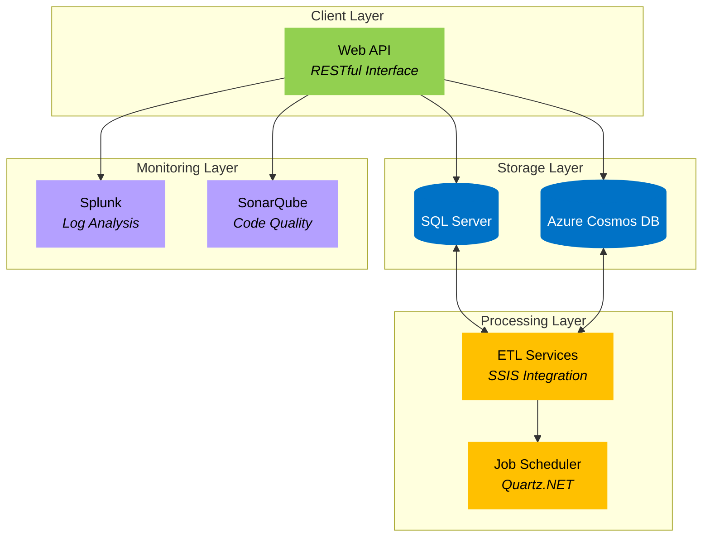

Based on the provided enterprise cloud monitoring and automation dashboard project plan, I'll present a comprehensive analysis focusing on architectural design, component relationships, and implementation considerations.

###  System Architecture Overview

The proposed architecture consists of multiple interconnected components forming a cohesive monitoring and automation system. Here's the high-level architectural overview:



The diagram above illustrates the system's layered architecture, where:

- Green components represent API interfaces
- Blue components show data storage systems
- Yellow components indicate processing services
- Purple components highlight monitoring tools

Arrows indicate data flow and dependencies between components. Each layer serves a specific purpose:

- Client Layer handles external interactions through RESTful APIs
- Storage Layer manages persistent data across SQL Server and Cosmos DB
- Processing Layer orchestrates ETL operations and scheduled tasks
- Monitoring Layer ensures system health and code quality

###  Component Analysis

#### Data Storage Components

1. SQL Server Implementation
  - Primary storage for structured metrics and logs
  - Schema design focuses on efficient querying and indexing
  - Supports ACID compliance for transactional integrity
  - Example schema structure:

```sql
CREATE TABLE Metrics (
    Id INT PRIMARY KEY IDENTITY,
    Timestamp DATETIME2,
    Source NVARCHAR(100),
    MetricName NVARCHAR(100),
    Value FLOAT,
    Tags JSON,
    INDEX IX_Metrics_Timestamp_Source NONCLUSTERED (Timestamp, Source)
);
```


2. Azure Cosmos DB Integration
  - Handles semi-structured and unstructured data
  - Provides high availability and scalability
  - Example configuration:

```csharp
var cosmosClient = new CosmosClient(
    "AccountEndpoint=https://localhost:8081/",
    "AccountKey=C2y6yDjf5/R+ob0N8A7Cgv30VRDJIWEHLM+4QDU5DE2nQ9nDuVTqobD4b8mGGyPMbIZnqyMsEcaGQy67XIw/Jw==",
    new CosmosClientOptions { ApplicationRegion = Regions.WestUS }
);
await cosmosClient.CreateDatabaseIfNotExistsAsync("MonitoringDB");
await database.CreateContainerIfNotExistsAsync("Metrics", "/Source", 400);
```


#### Processing Layer Components

1. ETL Services (SSIS)
  - Manages data transformation between SQL Server and Cosmos DB
  - Implements data validation and cleansing
  - Supports scheduled operations
  - Example package structure:

```sql
CREATE PACKAGE ETL_Metrics
BEGIN
    -- Data Flow Task
    EXECUTE TASK "Extract Metrics"
    EXECUTE TASK "Transform Data"
    EXECUTE TASK "Load to Cosmos"
END;
```


2. Job Scheduler (Quartz.NET)
  - Orchestrates automated tasks
  - Manages job scheduling and execution
  - Handles retry logic and failure notifications
  - Example implementation:

```csharp
public class JobScheduler : IJob
{
    public async Task Execute(IJobExecutionContext context)
    {
        var metricsService = context.Scheduler.Context.Get<IMetricsService>();
        await metricsService.ProcessScheduledMetricsAsync();
    }
}
```


#### Monitoring Components

1. Splunk Integration
  - Collects and analyzes application logs
  - Provides real-time monitoring dashboards
  - Implements alerting mechanisms
  - Example log collection configuration:

```csharp
public class SplunkLogger : ILogger
{
    private readonly HttpClient _client;
    
    public async Task LogAsync(LogLevel level, string message)
    {
        var logEvent = new 
        { 
            Timestamp = DateTime.UtcNow,
            Level = level.ToString(),
            Message = message,
            Source = "EnterpriseMonitor"
        };
        
        await _client.PostAsJsonAsync("services/collector", 
            new { event_ = logEvent, sourcetype = "_json" });
    }
}
```


2. SonarQube Integration
  - Monitors code quality and security
  - Identifies potential issues
  - Tracks technical debt
  - Example configuration:

```bash
sonar-scanner.properties:
sonar.host.url=http://localhost:9000
sonar.login=admin
sonar.password=admin
sonar.projectKey=EnterpriseMonitor
sonar.sources=src/WebApi
```


###  Implementation Considerations

1. Security
  - Implement role-based access control
  - Encrypt sensitive data at rest and in transit
  - Regular security audits and vulnerability scanning
  - Secure API endpoints with JWT authentication


2. Performance Optimization
  - Implement caching mechanisms
  - Optimize database queries
  - Use connection pooling
  - Implement bulk operations for data processing


3. Scalability
  - Design for horizontal scaling
  - Implement load balancing
  - Use distributed caching
  - Support database sharding


4. Maintenance
  - Regular backups
  - Monitoring system health
  - Performance metrics tracking
  - Automated testing and deployment


###  Deployment Strategy

1. Local Development Environment
  - Containerized services using Docker/Podman
  - Isolated development environments
  - CI/CD pipeline integration
  - Example docker-compose configuration:

```yaml
version: '3'
services:
  api:
    build: ./src/WebApi
    ports:
      - "5000:80"
    depends_on:
      - sqlserver
      - cosmosdb
  
  sqlserver:
    image: mcr.microsoft.com/mssql/server:2019-latest
    environment:
      SA_PASSWORD: "YourStrongPassword!"
      ACCEPT_EULA: "Y"

  cosmosdb:
    image: mcr.microsoft.com/cosmosdb/linux/azure-cosmos-emulator
    ports:
      - "8081:8081"
```


2. Production Deployment
  - Azure Kubernetes Service (AKS)
  - Azure Container Registry (ACR)
  - Infrastructure as Code (IaC)
  - Zero-downtime deployments


This comprehensive implementation plan provides a robust foundation for building an enterprise-grade monitoring and automation dashboard. The architecture ensures scalability, maintainability, and reliability while meeting security and performance requirements. Regular reviews and updates of this plan will help adapt to evolving business needs and technological advancements.
